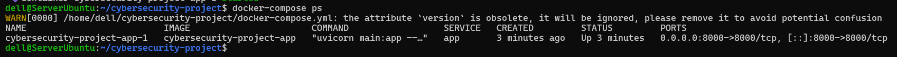
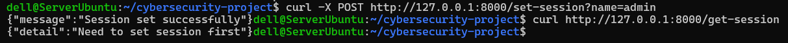
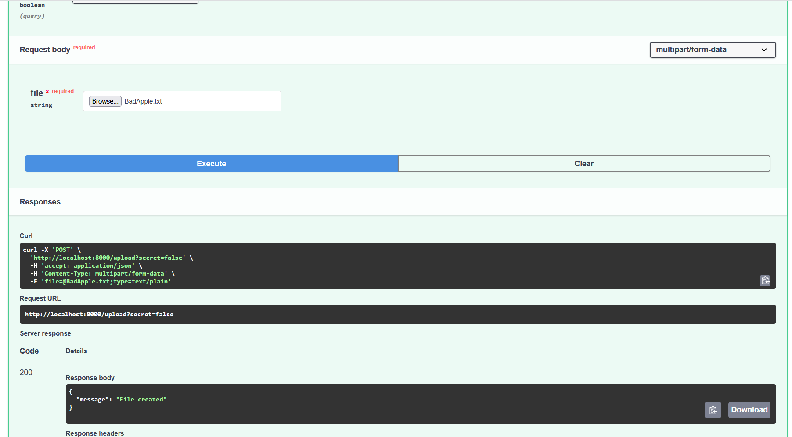
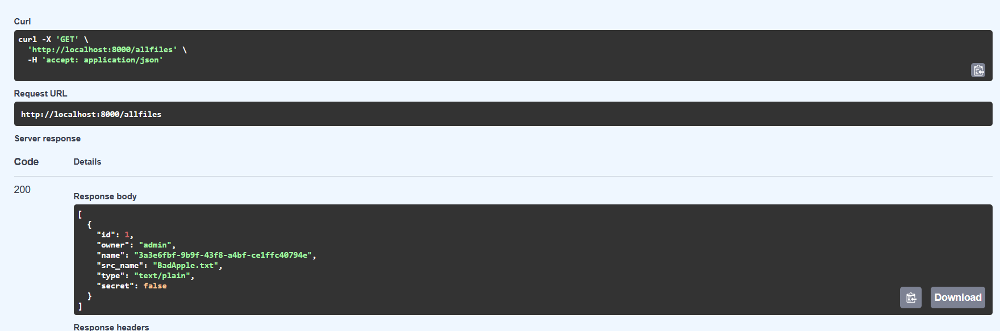
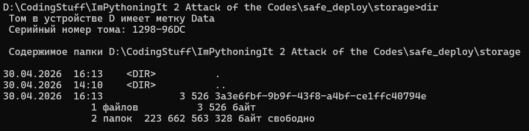
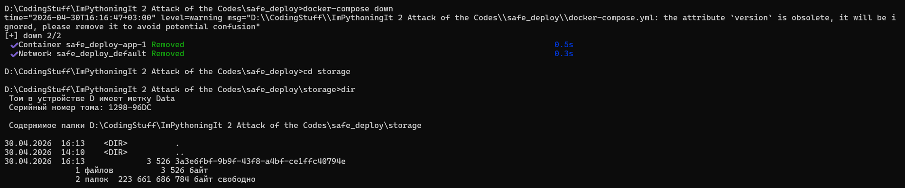

Docker Status

Я пытался всё-таки отправить файл через сервер, но это не получилось, так как не сохраняется сессия. Без неё я не могу отправлять файлы. Поэтому вторая часть репорта будет сделана не на сервере, но суть такая же

Sending out BadApple

Check the files to see it there

Check the storage to see it there

Turn off docker and see file still in the folder

