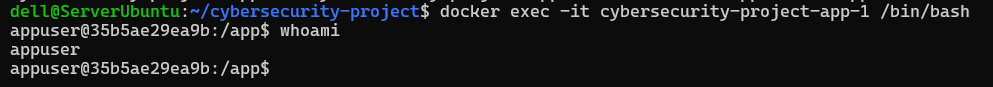
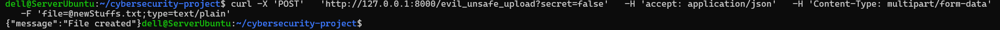

Вся информация отчёта находится в trivy.txt. Я пытался избавиться от HIGH, но оно не идёт никуда. Сам сайт docker говорит что 3.14.4-slim это хорошо и я хочу ему верить, но trivy не хочет ему верить.

Для того что бы загрузка файлов работала на сервере, пришлось создать ***evil_unsafe_upload***. Он оч злой и оч небезопасный и будет удалён как только надо будет, но это нужно так как я не могу сохранить сессию для загрузки файла

whoami

Evil upload

