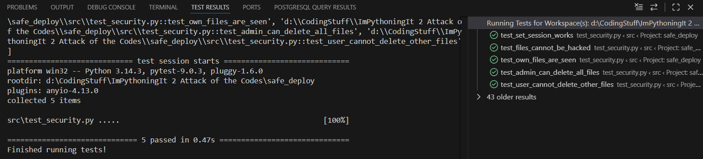

Test results:


Test code:
```python
from fastapi.testclient import TestClient
from main import app
import main

def test_set_session_works():
    with TestClient(app, base_url="https://127.0.0.1") as client:
        client.post("/set-session", params={"name" : "admin"})
        response = client.get("/get-session")
        assert response.status_code == 200
        assert response.json()["name"] == "admin"

def test_files_cannot_be_hacked():
    with TestClient(app, base_url="https://127.0.0.1") as client:
        client.post("/set-session", params={"name" : "bob"})
        response = client.get("/files/1")
        assert response.status_code == 404
        response = client.get("/files/3")
        assert response.status_code == 404

def test_own_files_are_seen():
    with TestClient(app, base_url="https://127.0.0.1") as client:
        client.post("/set-session", params={"name" : "bob"})
        response = client.get("/files/2")
        assert response.status_code == 200

def test_admin_can_delete_all_files():
    with TestClient(app, base_url="https://127.0.0.1") as client:
        client.post("/set-session", params={"name" : "admin"})
        response = client.delete("/files/1")
        assert response.status_code == 200
        response = client.delete("/files/2")
        assert response.status_code == 200
        response = client.delete("/files/3")
        assert response.status_code == 200
        assert main.file_db == []

def test_user_cannot_delete_other_files():
    with TestClient(app, base_url="https://127.0.0.1") as client:
        client.post("/set-session", params={"name" : "bob"})
        response = client.delete("/files/1")
        assert response.status_code == 404
```

К сожалению, почему-то тесты не хотят дружить со static. Я ещё не знаю как это решить
